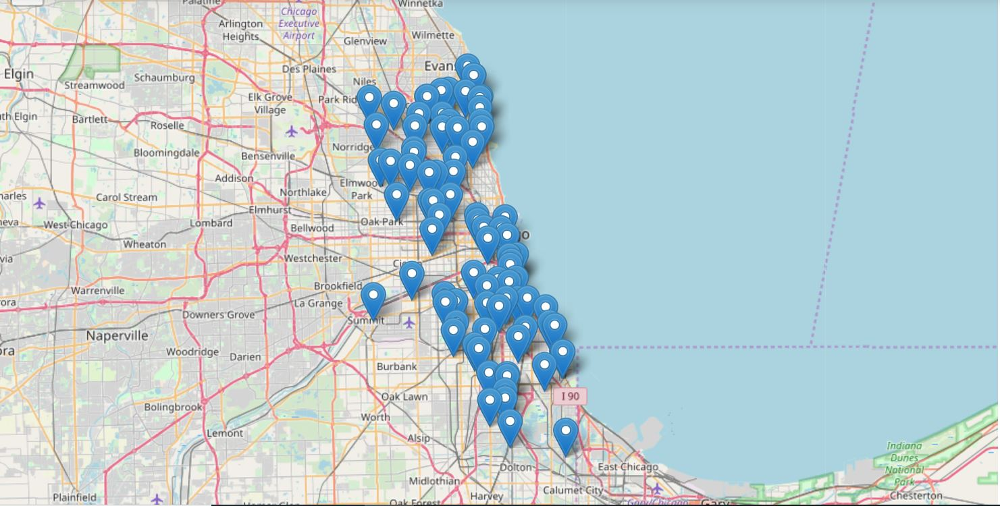
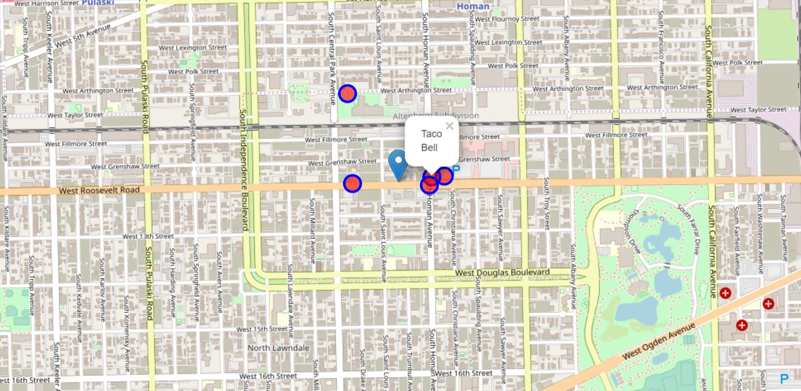
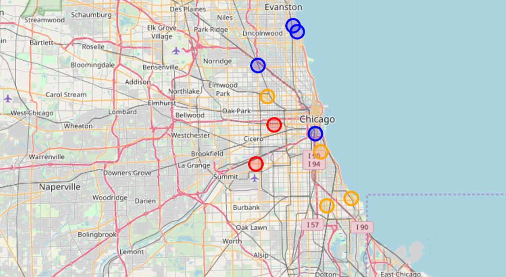

# Coursera_Capstone_Report
# Find the Senior Apartments with the Best Quality of Life in Chicago
For the coding part, please refer to the jupyter notebook Capstone_Project.ipynb

## Introduction
In Chicago, both the city government and the Chicago Housing Authority (a separate body whose Board of Commissioners is nominated by the mayor of Chicago and confirmed by the City Council) work to provide rental housing priced below market rates and other housing subsidies. Each uses a mix of subsidized developments and vouchers that households can use on the private market. The apartments that get involved in this initiatve are called Affordable Rental Housing Developments. In these housing developments, there are many complexes that are reserved for senior citizens with lower income, and there are 90 senior citizen apartments in the city of Chicago. This project aims on measuring the average quality of life of these senior apartment. We are interested in the geographic distribution of senior apartments with different levels of quality of life. 
 

## Data
As for the dataset of senior apartments, we download the data from the Chicago Open Data Portal <https://data.cityofchicago.org/Community-Economic-Development/Affordable-Rental-Housing-Developments/s6ha-ppgi>
The dataset of senior apartments consists of following important features: 
 
Community Area Number, Community Area Name, Property Type, Property Name, Latitude, and Longitude
 
We are interested in these features because we will filter on the property type, as we are only interested in the senior apartments among all of the affordable rental housing developments. Also, we will refer to the latitude and longitude when we use Foursquare API to search for the nearest venues
 
Moreover, we are using Foursquare API to search for the nearest venues of each senior apartment, which will be used to measure the quality of life in our studies. Concerning the limitation of a regular Foursquare developer account, we will only request 5 venues near each senior apartment within the range of 500 meters. Of each venue, we will also get its rating score using the Foursquare API.

## Methodology
In order to measure the quality of life of each senior apartment, we will calculate the average rating score of its five nearby venues that we request from the Foursquare API

## Part 1. Import all Necessary Packages
Please refer to the Jupyter Notebook Capstone_Project.ipynb

## Part 2. Import Affordable Housing Data
Please refer to the Jupyter Notebook Capstone_Project.ipynb

## Part 3. Visualization of the Senior Apartments
We found out that the community areas with most senior apartments are Belmont, Near South Side, and Chicago Lawn, which are located in the West Side and South Side of the City of Chicago. Also, when we look at the geographical distribution of these senior apartments, the majority are located in the Northwest Side, West Side, and the South Side.
 
 

## Part 4. Call Foursquare API and Import Data
For each apartment in our senior apartments data, we use Foursquare API to find 5 nearest venues within the range of 500 meters. For each venue, we collected the information of its venue_id, venue_name, venue_category, and its geographic coordinates. 
Please refer to the example of the visualization of 5 venues near the apartment "Roosevelt Towers"
 
 

## Part 5. Find the Rated Scores of Venues Nearby
We call the Foursquare API again, trying to find the rated score of all venues in our dataset. However, many of the venues in our collected data do not have corresponding rated score, such as a bus station or train station. Also, due to the limitations of a regular Foursquare developer account, we are only allowed to get 950 calls each day. As a result, we only find the scores of only a portion of our aggregated dataset. Still, this portion is enough informative, which will be explained later on. 
 
Finally, we found the scores of the venues near 10 senior apartments; then we use a groupby mean method to aggregate our findings, thereby calculating the average score of venues of an apartment complex, which will be measured as "quality of living" in our studies. In our findings, we find that the complex "Wayne Senior Housing" has the largest average score, and the complex "Midway Pointe Senior Living" has the lowest average score.
 
Again, we look at the geographical distribution of these apartments. The apartments with score above 8 are painted blue, while the apartments with score between 7 and 8 are painted orange. Also, the apartments with score below 7 are pained red. If we look at the geographical distrubutions, we conclude that the "blue apartments" are mainly located in downtown or the North Side of the city, while the "orange apartments" and "red apartments" are located in the West Side and South Side of the city where the majority of senior apartments are located in. 
 
 

## Conclusion
According to our findings, we conclude that the majority of senior apartments with above average living qualities are located in downtown and the North Side, while the apartments with average and below average living qualities are located in the West Side and South Side of the city. However, the majority of senior apartments are located in the West Side and South Side. The housing agencies of the city government should take this disproportionality into consideration when they decide the locations future senior apartments. 

## Caveats
We only use one measurement of living quality using the Foursquare data. There must be multiple ways and methods to measure the living qualities, such as public transportation coverage, crime, etc.
 
We could have requested more data from Foursquare API if we are company users, which will make our studies much more informative.
